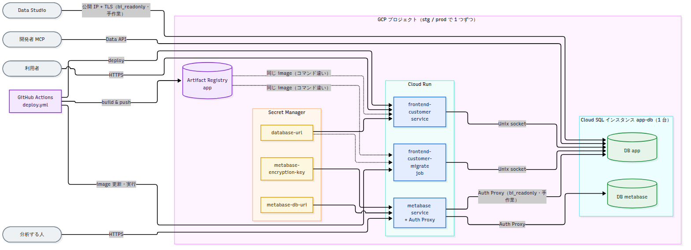
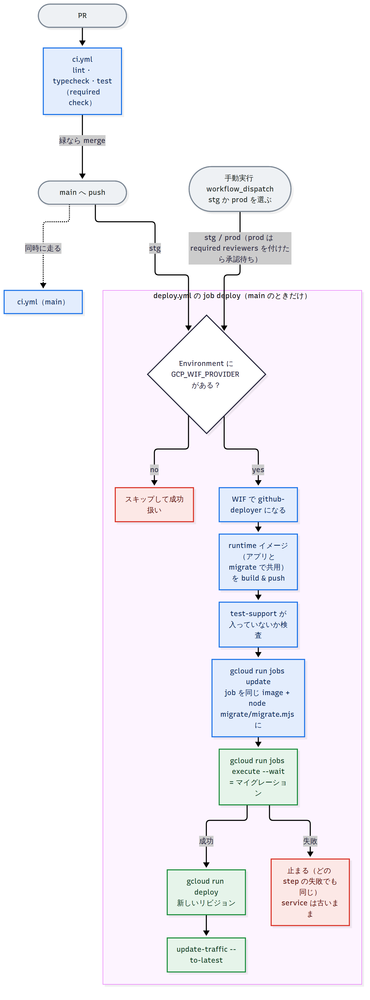
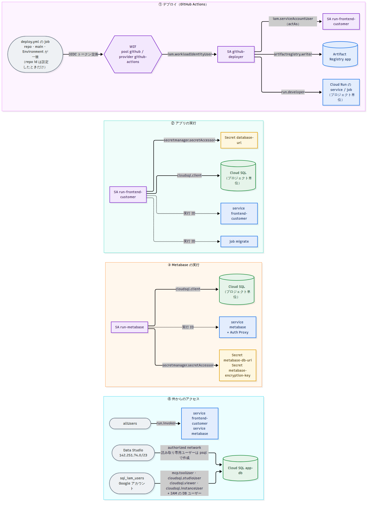
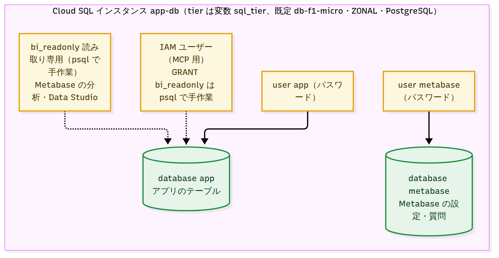

# 構成図

`infra/`（Terraform）と `.github/workflows/`（GitHub Actions）から起こした図。元は同じ名前の `.mmd`（Mermaid）で、`.png` は `bash scripts/render-diagrams.sh` が一括で作る。
作り直す手順（何をどこから読むか）はスキル `infra-diagram`（`.claude/skills/infra-diagram/SKILL.md`）。図はコードの写しなので、食い違ったらコードが正しい。

## 全体（`system.mmd`）
利用者・分析する人・Data Studio・GitHub Actions から、Cloud Run・Secret Manager・Cloud SQL へのつながり。stg と prod は別の GCP プロジェクトで、同じ構成が 1 つずつある。

## デプロイの流れ（`deploy.mmd`）
main への merge で stg、手動実行で stg か prod。migrate ジョブが成功してからサービスを更新する。

## IAM（`iam.mmd`）
だれが、どの役割で、何にアクセスできるか。

## Cloud SQL の中身（`database.mmd`）
インスタンス 1 台の中の database とユーザー。

